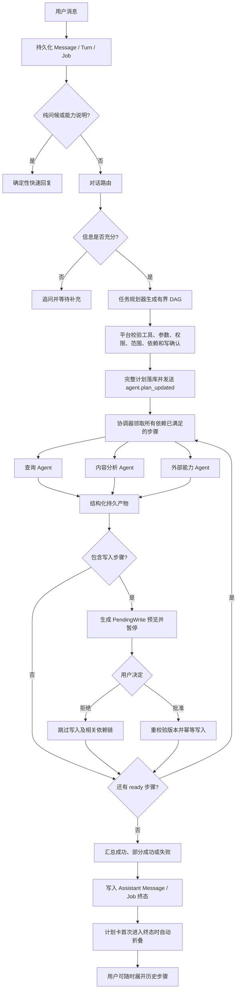

# Agent 使用手册

Agent 是 AI Assist 内置的对话入口：普通问候和“你能做什么”可直接回复；查询、分析和写入请求会先生成受控任务。写入操作必须先显示预览并由用户确认，MCP 外部能力只允许由服务器管理员预先配置。

## 1. 当前工作流



各节点使用的 Prompt/Skill 与策略如下。这里的“Prompt”是版本化 AI 配置模块，不会通过计划事件发送到浏览器；“Skill”是同模块下用户可选的指令和工具默认参数版本。

| 节点 | Prompt / Skill | 是否调用模型 | 平台强制策略 |
|---|---|---:|---|
| 持久化与快速回复 | 无 | 否 | 消息先落库；纯问候使用整句匹配，不能吞掉混合任务 |
| 对话路由 | `conversation_route` Prompt + 当前激活 Skill | 是 | 只能选安全工具清单；输出必须符合 `conversation-route.v1`；写操作必须声明确认 |
| 任务规划 | `agent_task_plan` Prompt + 当前激活 Skill | 复合任务是；原子任务可确定性规划 | 输出 `agent-task-plan.v1`，最多 12 步、深度最多 4；模型不能指定凭据、扩大范围或授予权限 |
| 查询步骤 | 工具绑定的 `article-query-agent`；无额外规划 Prompt | 否 | 只访问当前用户数据；参数按工具 Schema 校验 |
| 内容分析步骤 | `agent_content_analysis` Prompt + 当前激活 Skill；绑定 `editor-agent` | 是 | 只读取前置产物给出的文章 ID；输出结构化提案，不声称已保存 |
| MCP 步骤 | 绑定 `mcp-tool-agent`；实际工具由服务端注册 | 视 MCP 工具而定 | 连接、授权、超时和参数 Schema 每次重校验；事件不含原始响应 |
| 写入步骤 | 无可绕过确认的 Prompt/Skill | 否 | 先生成 `PendingWrite`；批准后才设置一次性写权限并校验对象版本 |
| 协调与汇总 | 无 | 否 | PostgreSQL 是状态真相；依赖 ready 才入队；每计划最多并发 4；失败只阻断其后代 |
| 实时 UI | 无 | 否 | 复用 `/events/jobs` SSE；只接受更高版本快照；活动展开、首次终态自动折叠、手动选择优先 |

计划步骤之间不传自由文本 Prompt，而是传递带 Schema 的持久产物。这样 worker 重启、断线重连和失败链重试都能从数据库恢复，也避免把某个 Agent 的内部指令或原始输出扩散给其他节点。

## 2. 最小可用配置

先从示例创建 `.env`，并保留已有数据库、JWT 与 RabbitMQ 配置。要使用任务型对话路由，需要配置一个 LLM 提供商：

```dotenv
LLM_PROVIDER=openai
LLM_DEFAULT_MODEL=gpt-4o-mini
# 可选：兼容 OpenAI 的自定义网关地址；留空即使用官方地址
LLM_BASE_URL=
```

将 API 密钥写入 `deploy/secrets/llm_provider_key`，不要写入 `.env`、Git、日志或前端：

```bash
umask 077
printf '%s' '你的提供商密钥' > deploy/secrets/llm_provider_key
chmod 600 deploy/secrets/llm_provider_key
chown 10001 deploy/secrets/llm_provider_key
```

也可选择：

| 提供商 | `.env` | 密钥文件 |
|---|---|---|
| OpenAI | `LLM_PROVIDER=openai` | 必需：`deploy/secrets/llm_provider_key` |
| Anthropic | `LLM_PROVIDER=anthropic` | 必需：`deploy/secrets/llm_provider_key` |
| Ollama | `LLM_PROVIDER=ollama`、`LLM_BASE_URL=http://主机:11434`、`LLM_DEFAULT_MODEL=模型名` | 不需要 |
| 不使用模型 | `LLM_PROVIDER=none` | 不需要；仅确定性问候与能力说明可直接回复，其他请求会提示稍后重试 |

生产环境首次部署或中间件、Compose 配置发生变化时使用 `./deploy/scripts/deploy.sh up`。它会提交并推送变更、等待 CI、拉取中间件、构建镜像、执行迁移并检查 API 与 worker 健康状态。日常代码更新使用 `DEPLOY_COMMIT_MESSAGE='🐳 chore: 部署最新代码' ./deploy/scripts/deploy.sh fast-up`：它会提交并推送代码，让 CI 异步运行，同时利用 Docker 缓存构建前后端、执行迁移并只重建应用容器。只需重新启动当前版本时使用 `./deploy/scripts/deploy.sh restart`；该命令复用现有镜像和配置，不提交代码、不运行 CI、不拉取或构建镜像，也不执行迁移。

## 3. 可选：配置 MCP 外部工具

不使用 MCP 时无需创建文件；部署脚本会生成空占位文件，并将其视为“未配置 MCP”。如需启用 MCP：

1. 复制 `deploy/secrets/mcp-connections.example.json` 为 `deploy/secrets/mcp_connections.json`。
2. 填写受控服务端的连接信息和令牌；此文件仅在服务器上保存，不提交 Git。
3. 为每个工具填写 `tool_policies`。只读工具标为 `read`；写工具必须标为 `write` 且 `previewable: true`，否则不会对用户开放。
4. 设为仅运行用户可读：`chmod 600 deploy/secrets/mcp_connections.json && chown 10001 deploy/secrets/mcp_connections.json`。
5. 重新部署。

最小的“已配置但没有外部工具”文件为：

```json
{"connections": {}}
```

不要让浏览器或用户消息提供 MCP URL、令牌或连接字符串。Compose 会把该文件挂载为容器内的 `/run/secrets/mcp_connections`；`.env` 中的 `MCP_SECRETS_FILE` 会由部署配置覆盖，无需改成真实路径。

## 4. 使用、确认与重试

- 打开“Agent”，直接输入自然语言请求。任务计划会在对应用户消息下实时展开，显示每个 Agent、工具、依赖、状态和安全摘要。
- 计划首次进入成功、部分成功、失败或取消等终态时会自动折叠；点击摘要可重新展开，后续轮询不会覆盖当前页面内的手动选择。
- 打开“设置 → 管理 AI Prompt 与 Skill”，可按模块创建 Prompt/Skill 新版本、切换历史版本并执行安全试运行；修改这些行为不需要调整 `.env` 或重新部署。
- “查一下最近文章”等未指定数量的请求使用对话路由 Skill 中的 `posts.list_recent.limit`，默认值为 10；用户明确说出的数量优先。
- 配置中心只允许调整业务指令和已注册工具的默认参数。数据权限、参数 schema、最大数量和写入确认由平台强制执行，不能通过 Prompt 关闭。
- 出现“等待确认”时，先核对预览再确认；未确认前不会执行写入。
- 出现“可以安全重试”时，可在计划卡点击“重试失败步骤”。系统只重置可重试失败步骤及其后代，已经成功的步骤和写入不会重复。
- 打开会话默认只加载最近 12 条消息；需要查看旧记录时点击“加载更早消息”。终态失败最多提示 1 条并在 24 小时后自动退出提示区，历史记录不会从数据库删除。
- 查看运行状态：`./deploy/scripts/deploy.sh ps`。
- 快速发布代码到生产：`DEPLOY_COMMIT_MESSAGE='🐳 chore: 部署最新代码' ./deploy/scripts/deploy.sh fast-up`。它不等待 CI，也不拉取或重启 PostgreSQL、Redis、RabbitMQ；CI 会在 GitHub 上异步继续运行。
- 秒级重启现有应用容器：`./deploy/scripts/deploy.sh restart`。它不重启 PostgreSQL、Redis 或 RabbitMQ；代码、依赖、镜像、Compose 配置或数据库结构有变化时仍必须使用 `up`。
- 查看日志：`./deploy/scripts/deploy.sh logs worker-heavy`，再按 `plan_id`、`turn_id`、`task_id` 或 `conversation_turn_execution_failed` 检索。

## 5. 使用 MCPJam 检查内部博客能力

AI Assist 在 `/api/v1/mcp/blog/mcp` 提供独立的 Streamable HTTP MCP
入口。它与 Agent 作为 MCP Client 访问外部服务的配置无关；此入口只暴露经过筛选的博客只读工具，
不会自动映射全部 REST API，也不提供创建、修改、删除或发布操作。

先为已有用户签发最长 90 天的只读 Token：

```bash
./deploy/scripts/deploy.sh issue-blog-mcp-token USER@example.com 30
```

Token 只显示一次，不得写入仓库、日志、Prompt 或普通配置文件。在 MCPJam Desktop 中新增：

- Transport：`Streamable HTTP`
- URL：`https://llm.roguelife.de/api/v1/mcp/blog/mcp`
- Header：`Authorization: Bearer <刚签发的 Token>`

连接后应看到 `blog_list_posts`、`blog_get_post`、`blog_search_posts`、`blog_timeline`、
`blog_list_categories` 和 `blog_list_tags`。这些名称同时兼容 Claude/Anthropic 的工具命名限制。
Token 过期、用户被停用或 Token 类型/作用域不符时，
入口统一返回 `401`；普通网页登录 Access Token 不能用于该入口。

若要让 AI Assist 自身的 Agent 把这组博客能力作为第一方 MCP 使用，执行：

```bash
./deploy/scripts/deploy.sh configure-blog-mcp USER@example.com 90
```

该命令会直接更新仅容器可读的 MCP secret，Token 不会输出到终端；随后运行
`fast-up` 使所有 Agent 进程重新加载连接。配置中的 `auto_grant` 只适用于运维已审查的
第一方连接，普通第三方 MCP 默认仍必须逐工具授权。

常见检查顺序：先确认 `LLM_PROVIDER` 与密钥文件是否匹配；再检查容器健康状态；最后检查 MCP 文件是否为有效 JSON（或保持为空/`{"connections": {}}`）。
