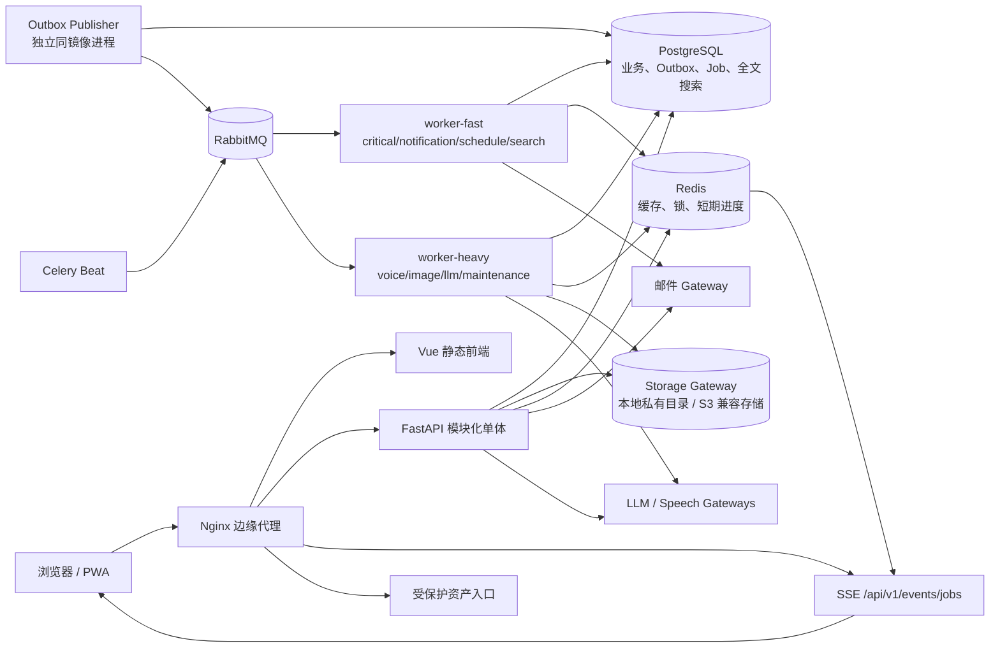
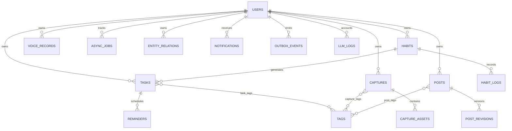

# AI Assist MVP 总体设计

本文件按产品总需求指定的顺序汇总设计结论。可执行细节分别落在数据模型、契约和任务清单中。

## 1. 产品模块划分

| 模块 | MVP 职责 | 关键边界 |
|---|---|---|
| 身份与设置 | 登录、刷新、退出、时区、通知和 AI 场景设置 | 所有数据必须带 owner；不开放公众注册 |
| 今日工作台 | 当前任务、时间线、Todo、习惯、逾期、冲突、建议、最近收藏、任务中心摘要 | 聚合读取，不复制业务数据 |
| 任务与日历 | Todo CRUD、固定事件、周视图、拖拽/拉伸、提醒、调整预览与应用 | 固定事件永不被 AI 移动 |
| 习惯 | 周期规则、每日任务、打卡/计时/跳过、统计 | 生成任务以 habit+date 幂等 |
| 快速录入 | 文字、语音、拍照、日程、笔记、博客灵感 | 媒体先保存再处理；时间结果先确认 |
| 收藏 | 图片卡片、筛选、详情、AI 元数据、转换与关联 | 用户事实与 AI 推测分别存储/显示 |
| 博客 | Markdown、草稿/私有/公开、来源关联、AI 差异 | AI 不覆盖当前正文；公开必须显式 |
| 搜索 | 跨类型关键词、分组、高亮、筛选 | PostgreSQL 第一阶段；向量能力延后 |
| AI 助手 | 安排、拆分、查找、分析、总结、博客草稿 | 先查授权数据，再返回结构化动作卡片 |
| 通知与任务中心 | 站内/邮件提醒、异步进度、失败和重试 | 业务状态在数据库；UI 不暴露内部队列术语 |

## 2. 前端页面结构

### 路由与页面

| 路由 | 页面 | 主要区域 | 移动端要点 |
|---|---|---|---|
| `/login` | 登录 | 邮箱、密码、错误与首次配置提示 | 单列、系统密码管理器兼容 |
| `/today` | 今日 | 快速输入、当前任务、时间线、Todo、习惯、AI 建议、最近收藏 | 卡片纵向排序，当前任务首屏可见 |
| `/calendar` | 日历 | 周视图、未排期任务、冲突、调整预览 | 日列可横向切换；未排期区用抽屉 |
| `/tasks` | 任务 | 筛选、分组、批量状态、任务详情抽屉 | 筛选折叠，主操作固定底部 |
| `/habits` | 习惯 | 今日卡、统计、热力图、习惯编辑 | 一键打卡与计时，不依赖 hover |
| `/captures` | 收藏 | 瀑布流/列表、筛选、待处理、详情抽屉 | 拍照入口优先，卡片渐进加载 |
| `/posts` | 博客 | 草稿/已发布、Markdown 编辑、预览、差异 | 编辑与预览分页切换，自动保存草稿 |
| `/assistant` | AI 助手 | 意图入口、上下文范围、结构化结果卡片 | 操作卡片优先，聊天记录为次要区域 |
| `/search` | 搜索 | 查询、类型分组、筛选、高亮 | 输入常驻顶部，结果虚拟化预留 |
| `/settings` | 设置 | 账户、时区、通知、Provider 场景、存储与数据 | 敏感值仅显示是否已配置 |

### 导航与全局层

- 桌面左侧导航：今日、日历、任务、习惯、收藏、博客、AI 助手、设置。
- 移动底部导航：今日、日历、快速添加、习惯、我的；“我的”中进入任务、收藏、博客和设置。
- 顶部层：全局搜索、同步状态、通知入口、后台任务中心入口。
- 全局覆盖层：快速添加面板、任务详情抽屉、收藏详情抽屉、语音确认卡、日程预览抽屉。
- 状态管理：身份、任务中心和全局 UI 使用共享 store；业务页面列表使用按模块 store；服务端状态
  以查询缓存/模块 store 统一失效，不在多个组件复制。

## 3. 页面交互流程

### 快速文字任务

1. 用户在今日页输入标题并提交。
2. 前端显示本地提交态；后端提交任务、活动记录和 outbox 后返回正式 ID。
3. 卡片替换为已保存状态；后续分类/耗时建议以非阻塞建议出现。
4. 保存失败时保留输入内容并提供重试，不清空编辑框。

### 语音转任务

1. 点击快速添加 → 语音记录，开始/停止录音。
2. 上传成功后立刻得到 voice record ID，并在任务中心显示“等待处理”。
3. 后台转写 → Schema 解析 → 状态进入 `waiting_user`。
4. 前端弹出确认卡；用户编辑日期、时间、提醒等字段。
5. 确认接口创建正式任务并记录来源；放弃不会删除原音频，用户可稍后恢复。

### 拍照收藏

1. 点击快速添加 → 拍照收藏，选择图片并可附一句描述。
2. 前端获得上传会话，上传原图后提交收藏；收藏卡立即出现在“待处理”。
3. 后台依次执行校验/哈希、元数据清理、缩略图/预览、基础文字识别、AI 描述与标签。
4. SSE 更新单张卡片进度；失败只在任务中心和卡片状态展示。
5. 详情抽屉用“你填写的 / AI 建议”区分字段，保存编辑时用户值优先。

### 日历拖拽与 AI 调整

1. 用户将未排期任务拖到周日历，前端先显示目标时间和冲突预判。
2. 更新接口带实体版本；成功后同步今日和任务列表，冲突则恢复位置并提示刷新。
3. AI 调整请求返回 async job；完成后打开预览，不直接写任务。
4. 每条建议包含原时间、新时间、影响、冲突、理由和可选复选框。
5. 应用接口逐项做版本检查；固定/已变化项拒绝，成功项返回可撤销活动 ID。

### 博客生成与改写

1. 从 Todo/收藏选择“生成博客草稿”，立即创建私有空草稿与来源关联。
2. 后台生成建议 revision；完成后以差异视图打开。
3. 用户应用、忽略或重新生成；只有应用才建立新的正文 revision。
4. 发布前预览可见性、SEO 信息和封面；确认后才公开并产生 `post.published` 事件。

## 4. 系统架构图



关键原则：浏览器只依赖业务 API/SSE；业务模块不认识具体 Provider；RabbitMQ 只传标识符和参数；
PostgreSQL 保存最终状态；Redis 丢失不影响业务恢复。

## 5. 后端模块划分

| 模块 | 应用服务 | 所拥有的模型/规则 |
|---|---|---|
| `auth` | login、refresh、logout、current user、CSRF | users、refresh_sessions |
| `tasks` | CRUD、排序、冲突、预览、应用、撤销 | tasks、reminders、schedule_previews、task_tags |
| `habits` | 规则、生成、打卡、计时、统计 | habits、habit_logs；调用 tasks 创建习惯任务 |
| `captures` | 上传会话、创建、资产、元数据合并、转换 | captures、capture_assets、capture_tags |
| `voice` | 录音登记、处理状态、确认/放弃 | voice_records；确认后调用 tasks/posts |
| `posts` | 草稿、revision、发布、订阅 | posts、post_revisions、post_tags |
| `search` | 关键词解析、统一结果、索引更新 | search_documents |
| `assistant` | 意图、授权上下文、结构化动作 | assistant_runs/async_jobs；不直接绕过业务服务 |
| `notifications` | 站内通知、提醒派发、邮件尝试 | notifications、notification_deliveries |
| `jobs` | 创建、进度、重试、取消、SSE 重放/快照 | async_jobs、async_job_events |
| `relations` | 跨实体关联与所有权校验 | entity_relations |
| `llm` gateway | chat、structured、summarize、classify、embedding、vision | llm_logs、场景配置；Provider adapters |
| `speech` gateway | transcribe | Provider adapters；不创建业务实体 |
| `storage` gateway | put/get/delete/sign/metadata | 默认 local 私有目录 adapter；可选 S3 兼容 adapter |
| `outbox` | append、claim、publish、reconcile | outbox_events、consumer_receipts、idempotency_records |

模块只能通过应用服务和领域事件协作；路由层不得直接拼接跨模块数据库写入。共享 `core` 仅包含
配置、错误、身份上下文、追踪、时间、分页和基础模型，不放业务规则。

## 6. 数据库 ER 设计

完整字段、约束和状态机见 [data-model.md](data-model.md)。核心关系如下：



所有用户实体均有 `user_id`，复合唯一约束包含 `user_id`；软删除记录默认从业务查询排除。时间戳
使用带时区类型，重复规则使用受控 RRULE 子集，金额使用数值和 ISO 币种。

## 7. RabbitMQ 队列设计

| 队列 | 路由键示例 | Worker | 超时/重试策略 | 说明 |
|---|---|---|---|---|
| `critical` | `notification.critical.*` | fast | 短超时，快速重试，高优先级 | 重要提醒与恢复命令 |
| `notification` | `notification.email.*`、`notification.in_app.*` | fast | Provider 退避，最大次数 | 普通通知 |
| `schedule` | `habit.generate.*`、`schedule.preview.*` | fast | 幂等，按业务时区 | 定时与日程计算 |
| `search` | `search.index.*` | fast | 可合并/覆盖旧任务 | PostgreSQL 索引文档 |
| `maintenance` | `maintenance.cleanup.*` | heavy | 低优先级、离峰、严格 time limit | 孤儿对象/保留期小批清理 |
| `voice` | `voice.transcribe.*` | heavy | 长超时、Provider 退避 | 只传 voice_record_id/asset_id |
| `image` | `image.thumbnail.*`、`image.analyze.*` | heavy | 步骤幂等、可断点 | 只传 capture/asset ID |
| `llm` | `llm.structured.*`、`llm.blog.*` | heavy | 场景超时、预算和 Schema 校验 | 只传实体引用和场景 ID |

- 交换机：`aiassist.commands`（topic）、`aiassist.events`（topic）、`aiassist.dlx`（topic）。
- 每个业务队列配置对应 `.dlq`；到达重试上限的消息带失败头进入 DLX，业务 job 标记 failed。
- 重试优先由 Celery countdown 实现；RabbitMQ 负责持久消息、publisher confirm、consumer ack 和 DLQ。
- `critical` 与重任务分队列；MVP 同属 worker-fast 进程组，但可独立设置并发/优先级并在负载增长后
  无代码变更地拆为独立 worker。

## 8. Celery Worker 设计

### worker-fast

- 消费 `critical,notification,schedule,search`，prefetch multiplier=1，启用 late ack。
- 任务必须短小；不执行 OCR、模型推理或大图处理。
- 包含提醒派发、习惯任务生成、日程预览编排和搜索文档更新。Outbox Publisher 不经 Celery 唤醒。
- `critical` 任务使用独立优先级和较短 soft/hard time limit；通知发送记录每次尝试。

### worker-heavy

- 消费 `voice,image,llm,maintenance`，低并发，prefetch multiplier=1，按任务设置内存/时间上限。
- 图片管线拆为可幂等步骤，原始资产不变；派生资产使用版本化 object key。
- 语音转写和 LLM 解析是两个独立步骤，便于切换 Provider 和单独重试。
- 进程达到任务数或内存阈值后回收，防止媒体库泄漏。

### celery-beat

- 仅发出调度命令，不直接执行业务：到期提醒、每日习惯、outbox 扫描、失败补偿、过期上传清理。
- 调度任务使用数据库唯一键和分布式锁，Beat 重启或重复触发不会产生重复业务结果。

## 9. 事件与消息格式

完整 AsyncAPI 见 [events.asyncapi.yaml](contracts/events.asyncapi.yaml)。统一 envelope：

```json
{
  "event_id": "01K...ULID",
  "event_type": "capture.created",
  "event_version": 1,
  "occurred_at": "2026-07-22T10:30:00Z",
  "user_id": "uuid",
  "entity_type": "capture",
  "entity_id": "uuid",
  "trace_id": "32-hex-or-w3c-trace-id",
  "payload": { "asset_ids": ["uuid"], "pipeline_version": "v1" }
}
```

- Command 使用祈使型名称：`image.generate_thumbnail`、`voice.transcribe`、
  `llm.generate_blog`、`notification.send_email`。
- Event 使用已发生事实：`capture.created`、`capture.analyzed`、`task.completed`、
  `habit.checked_in`、`post.published`。
- 处理器先在 `consumer_receipts` 插入 `(consumer_name,event_id)`；冲突即视为已处理。
- 幂等键示例：`capture:{capture_id}:vision:v1`，并在 async job 或业务结果表上加唯一约束。
- payload 仅包含查找业务数据所需的 ID、版本和有限参数；敏感正文在 Worker 内按所有权读取。

## 10. REST API 列表

完整请求/响应与状态码见 [openapi.yaml](contracts/openapi.yaml)。所有私有接口位于 `/api/v1`。

| 领域 | 接口 |
|---|---|
| auth | `POST /auth/login`、`POST /auth/refresh`、`POST /auth/logout`、`GET /auth/me` |
| settings | `GET /settings`、`PATCH /settings`、`POST /settings/password` |
| today | `GET /today` |
| tasks | `GET/POST /tasks`、`GET/PATCH/DELETE /tasks/{id}`、`POST /tasks/{id}/complete` |
| calendar | `GET /calendar/week`、`POST /schedule-previews`、`GET /schedule-previews/{id}`、`POST /schedule-previews/{id}/apply` |
| habits | `GET/POST /habits`、`GET/PATCH/DELETE /habits/{id}`、`POST /habits/{id}/check-ins`、`POST /habits/{id}/skip`、`GET /habits/stats` |
| uploads | `POST /uploads`、`POST /uploads/{id}/complete`、`DELETE /uploads/{id}` |
| voice | `POST /voice-records`、`GET /voice-records/{id}`、`POST /voice-records/{id}/retry`、`POST /voice-records/{id}/confirm` |
| captures | `GET/POST /captures`、`GET/PATCH/DELETE /captures/{id}`、`GET /captures/{id}/assets/{asset_id}/access`、`POST /captures/{id}/convert` |
| posts | `GET/POST /posts`、`GET/PATCH/DELETE /posts/{id}`、`POST /posts/{id}/generate`、`GET /posts/{id}/revisions/{rid}/diff`、`POST /posts/{id}/revisions/{rid}/apply`、`POST /posts/{id}/publish` |
| search | `GET /search?q=...` |
| assistant | `POST /assistant/runs`、`GET /assistant/runs/{id}`、`POST /assistant/runs/{id}/actions/{action_id}` |
| jobs | `GET /jobs`、`GET /jobs/{id}`、`POST /jobs/{id}/retry`、`POST /jobs/{id}/cancel` |
| notifications | `GET /notifications`、`POST /notifications/{id}/read` |
| realtime | `GET /events/jobs` |
| public | `GET /public/posts/{slug}`、`GET /public/rss.xml` |

## 11. SSE 事件格式

详细规则见 [sse.md](contracts/sse.md)。示例：

```text
id: 01K0EVENTULID
event: job.updated
data: {"job_id":"uuid","status":"processing","progress":45,"current_step":"正在生成预览图","updated_at":"2026-07-22T10:31:00Z","trace_id":"..."}

```

- 连接建立后按 `Last-Event-ID` 从 PostgreSQL `async_job_events` 重放；无游标或游标过期时发送
  `jobs.snapshot`，Redis 仅唤醒查询，不承载事件真相。
- 增量事件包括 `job.updated`、`job.completed`、`job.failed`、`notification.created` 和 heartbeat。
- 客户端按 event ID 去重；重连携带 `Last-Event-ID`，服务端仍发送最新快照再继续增量。
- data 不含内部队列名、堆栈、Provider 密钥、原始提示或私有大文本。

## 12. Docker Compose 服务设计

| 服务 | 职责 | 持久化/健康 |
|---|---|---|
| `frontend` | 构建并提供 Vue 静态资源 | 只读镜像；HTTP health |
| `backend` | REST、SSE、受保护资产鉴权 | 等待 DB/迁移/必需存储；队列/Redis/AI 故障仅 degraded |
| `outbox-publisher` | 将已提交 outbox 可靠发布到 RabbitMQ | 复用 backend 镜像；租约回收、publisher confirm |
| `worker-fast` | 快队列、outbox、提醒与调度任务 | 复用 backend 镜像；Celery ping + 业务 heartbeat |
| `worker-heavy` | voice/image/llm | 复用 backend 镜像；严格资源限制 |
| `celery-beat` | 周期命令 | 持久 schedule 或声明式配置；单实例 |
| `postgres` | 业务、Outbox、Job、全文检索 | named volume；`pg_isready`；备份脚本 |
| `redis` | 缓存、锁、SSE 扇出 | 可选 AOF；数据可重建 |
| `rabbitmq` | 命令/事件队列、DLQ | named volume；management 仅内网 |
| 本地私有资产卷 | 默认对象存储：由 backend/worker-heavy 写入，Compose Nginx 以 `internal` location 发送 | named/bind volume；Web Root 外；备份校验；不是独立容器 |
| `minio`（`s3` profile） | 可选 S3 兼容开发/迁移验证 | 不作为默认公网生产依赖；固定镜像并明确维护风险 |
| `nginx` | TLS、同源路由、上传限制、SSE buffering off | 证书挂载；配置测试 |

Compose 使用健康条件而非固定 sleep；migration 通过一次性 `backend migrate` 命令显式运行。密码通过
部署环境/secret 文件注入，示例文件只给键名。数据库、RabbitMQ、Redis、MinIO 管理端口默认不发布公网。

## 13. 项目目录结构

目录树见 [plan.md 的 Project Structure](plan.md#project-structure)。约定补充：

- 后端模块内部统一 `router.py`、`schemas.py`、`service.py`、`repository.py`、`tasks.py`；只有确有逻辑
  时创建文件，避免空层级。
- SQLAlchemy 映射集中在 `app/models` 便于 Alembic metadata；业务服务位于 `app/modules`。
- Provider adapter 分别放在 `app/services/llm|speech|storage|mail/providers`，业务模块只导入 Protocol。
- 前端按业务模块共置页面、组件、store 和测试；跨模块通用组件必须有两个以上真实使用方。
- 运维文件集中在 `deploy/` 和根 Compose，不为每个模块建立独立服务目录。

## 14. MVP 开发阶段计划

| 阶段 | 可演示增量 | 验收门 |
|---|---|---|
| 0. 工程底座 | Compose、CI、配置、迁移、健康、统一错误与追踪 | 全栈启动、测试框架和备份恢复演练 |
| 1. 身份 + Todo + 今日 | 登录、任务 CRUD、今日聚合、任务抽屉 | AI 下线时任务仍可靠保存；所有权隔离 |
| 2. 周日历 + 提醒 | 拖拽/拉伸、冲突、固定事件、邮件/站内提醒 | 固定事件保护；重要提醒与重任务隔离 |
| 3. 习惯 | 创建、每日生成、打卡、计时、统计 | 重复调度不生成重复任务 |
| 4. 异步底座 + 语音 | Outbox、Jobs、SSE、转写、确认卡 | 原音频保留；时间字段必须确认 |
| 5. 收藏 | 上传、本地私有对象存储、缩略图、AI 元数据、瀑布流/详情 | AI 失败仍可看原图；来源标记正确 |
| 6. 搜索 | 跨模块关键词、分组、高亮 | 10 万记录 p95 目标与所有权过滤 |
| 7. 博客 + AI 操作 | Markdown、来源转草稿、diff、发布、结构化助手 | 私有默认；AI 不覆盖；无数据不虚构 |
| 8. 发布加固 | PWA、无障碍、日志、限流、备份、文档、E2E | quickstart 全新机器验收和故障注入 |

每一阶段先完成契约/迁移/测试，再实现后端和前端；阶段结束可独立部署验证。任务级顺序见 `tasks.md`。

## 15. 关键风险和技术取舍

| 风险/取舍 | 决策 | 缓解与触发升级条件 |
|---|---|---|
| 组件较多影响个人部署 | 保留 PostgreSQL/Redis/RabbitMQ；对象存储默认本地私有目录 | 提供健康、备份、资源下限；切换到 S3 兼容存储不改变接口 |
| 两类 Worker 中 critical 仍共享进程组 | MVP 遵循两 Worker 约束，用独立队列/优先级/并发 | 提醒延迟超过 SLO 时优先拆独立 critical worker |
| Outbox Publisher 增加一个运行进程 | 使用同一 backend 镜像和代码边界，直接扫描已提交行 | 监控最老 pending 年龄、租约和 confirm；不形成业务微服务 |
| 对象存储与 DB 无分布式事务 | 临时对象 + 业务提交 + finalize/补偿 | orphan 扫描、稳定 upload ID、重复 complete 幂等 |
| JWT 与 SSE | 同源 HttpOnly Cookie + CSRF，避免 URL token | 短期 access、refresh rotation、登录速率限制和撤销表 |
| PostgreSQL 统一搜索写放大 | MVP 用统一 search_documents，异步更新 | 显示索引中；规模/SLO 超限后再评估专用搜索服务 |
| AI 结果不可控 | Schema、场景配置、预算、超时、用户确认 | 记录失败样本和 usage；Provider 可替换；无效输出不写业务表 |
| EXIF 隐私与保留原图冲突 | 展示派生图清理定位；原图私有并按策略保留 | 设置中提供保留/清理策略，导出时明确告知 |
| MinIO 社区服务端停止维护 | 生产默认改用本地私有目录，保留 S3 Gateway/profile | 需要多节点/对象 API 时选择受维护 S3 服务并做兼容测试 |
| 媒体处理内存峰值 | 流式上传、像素/大小上限、heavy 低并发与进程回收 | 达到阈值时拆 image/voice worker，不改消息契约 |
| 大范围 MVP 延期 | 以阶段可演示切片推进，第二阶段功能硬边界 | 不在 MVP 引入同步、向量、Push、MCP 或原生端 |
